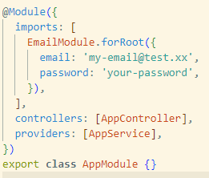
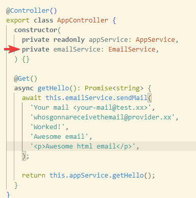

<p align="center">
  <a href="http://nestjs.com/" target="blank"></a>
</p>

[circleci-image]: https://img.shields.io/circleci/build/github/nestjs/nest/master?token=abc123def456
[circleci-url]: https://circleci.com/gh/nestjs/nest

  <p align="center">Nest Czar Poliedros© email</p>
    <p align="center">

## Installation

```bash
$ npm i @czarpoliedros/email
```

## Usage

Import the module into the module you want to send email, giving its email and password just like the image below:



Then you can import the EmailService in any provider you want:



## Test

```bash
# unit tests
$ npm run test

# e2e tests
$ npm run test:e2e

# test coverage
$ npm run test:cov
```

## Stay in touch

- Author - [Carlos Zansavio](carlos@czar.dev)

## License

Nest is [MIT licensed](LICENSE).
